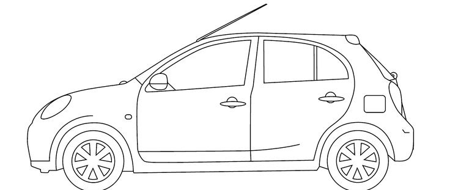
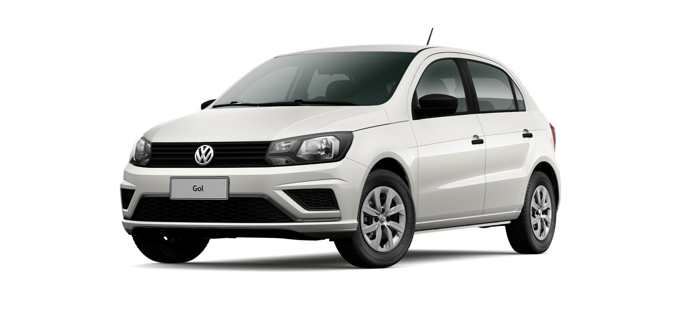

## Funcionamento do Programa

Todas as imagens contidas na pasta input serão vetorizadas e salvas na pasta output.

## Vetorização de Blueprints

```python
python ./main.py 1
```
### Imagem Original


### Imagem Vetorizada


## Vetorização de Images Reais

### Imagem Original


### Imagem Vetorizada.
